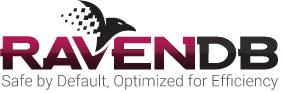

# RavenDB Bootcamp

Welcome to [RavenDB](http://ravendb.net/ "RavenDB is the premier NoSQL database for .NET") Bootcamp! This is a free, self-directed learning course.

Over this bootcamp you will learn how to create fully-functional, real-world programs with NoSQL Databases using RavenDB! 

The course is self-directed learning. You can do it at whatever pace you wish. 

## What will you learn?
In RavenDB Bootcamp you will learn how to write applications using RavenDB. You will learn a lot of NoSQL concepts too. 

## Summary

* Introduction
* Unit 1: Fundamentals
    * [Lesson 1: From installation to usage](src/Unit-1/lesson1)
    * [Lesson 2: Let's code](src/Unit-1/lesson2)
    * [Lesson 3: Basics of the `DocumentStore`](src/Unit-1/lesson3)
    * [Lesson 4: Loading documents](src/Unit-1/lesson4)
    * [Lesson 5: Querying fundamentals](src/Unit-1/lesson5)
    * [Lesson 6: Storing, modifying and deleting documents](src/Unit-1/lesson6)
* Unit 2: Beyond the basics
    * [Lesson 1: Getting started with indexes](src/Unit-2/lesson1)
    * [Lesson 2: Creating an index and querying using it](src/Unit-2/lesson2)
    * [Lesson 3: Multi-map indexes](src/Unit-2/lesson3)
    * [Lesson 4: Mapping(, filtering) and reducing](src/Unit-2/lesson4) 
    * [Lesson 5: The powerful LoadDocument server-side function](src/Unit-2/lesson5)
    * [Lesson 6: Getting started with Transformers](src/Unit-2/lesson6)
    * [Lesson 7: Statistics and some words about stale indexes!](src/Unit-2/lesson7)
* Unit 3: Almost advanced
    * [Lesson 1: Document Metadata](src/Unit-3/lesson1)
    * [Lesson 2: Getting started with Commands!](src/Unit-3/lesson2)
    * [Lesson 3: Performing batch operations](src/Unit-3/lesson3)
    * [Lesson 4: I am going through changes ...](src/Unit-3/lesson4)
    * [Lesson 5: Working with Listeners](src/Unit-3/lesson5)

[Let's begin!](src/Unit-1/lesson1)
