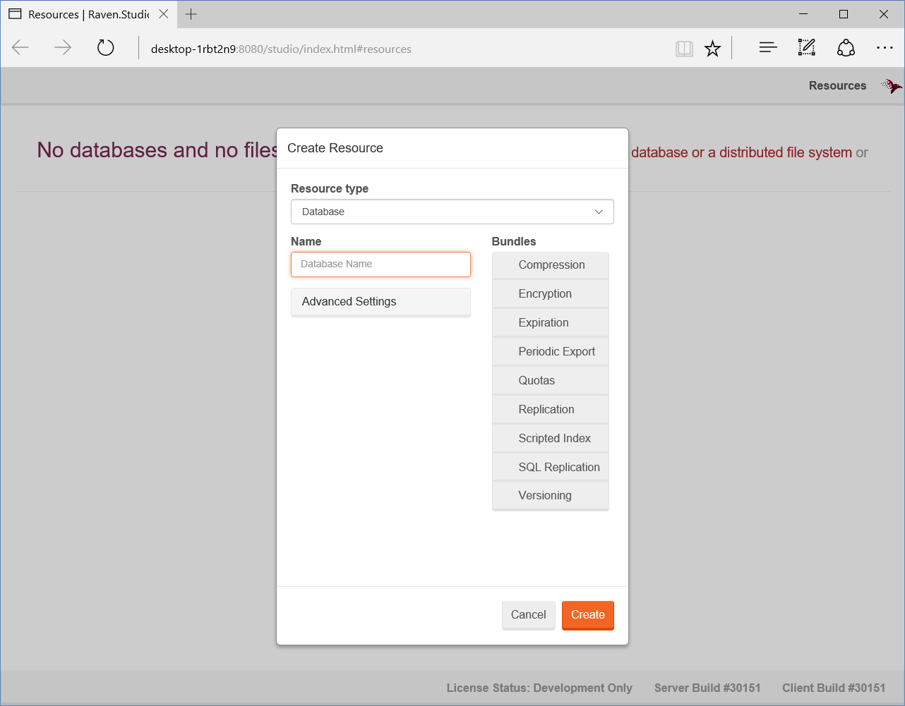
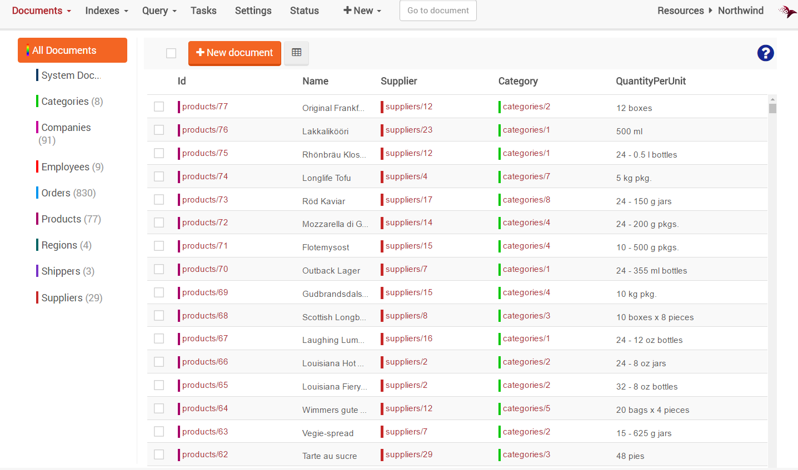
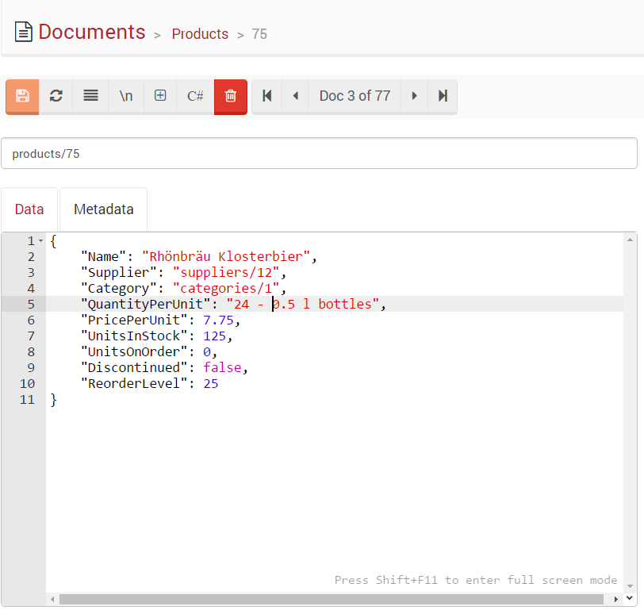

# Unit 1, Lesson 1 - From installation to usage

Here we go! Welcome to your first lesson.

In this lesson you will learn how to install RavenDB and start using it.

## RavenDB installation alternatives

There are several ways to run RavenDB.

The console mode is very useful for development, because you can see the incoming
requests to RavenDB, and you can interact with the server directly. For
production usage, you can install RavenDB as a Windows Service or in IIS.
For running in the cloud, you can use the RavenDB as a Service option provided
by RavenHQ.

In this lesson we will learn how to start RavenDB in the console.

## Exercise: Setting Up Everything

Go to the [RavenDB download page](http://ravendb.net/download), and download the
latest version. It is just a zip file - get it and extract it.

Go ahead and do it, I'll wait.

Done?! Now, open the extracted folder, locate the `Start.cmd` file and double
click it. This will start RavenDB in console (debug) mode as well as open your
browser to point to RavenDB Management Studio.



Congratulations! Now you have RavenDB up and running on your computer.

By default, RavenDB will try to use `http://localhost:8080` as its endpoint.
But, if you have a service already taking this port, RavenDB will try port 8081,
and so on.

## Exercise: Creating your first RavenDB database

First time opening the Studio, it will ask you to create a database. Let's do it!
To start, enter `Northwind` as database name and press the Create Button.

Congratulations! You just created your first RavenDB database... but, it is empty.

For learning purposes let's load some sample data into our database.
Open the `Northwind database` and go to the `Tasks` tab and then
to `Create Sample Data dialog`. Go ahead and press the `Create Sample Data button`.
After a little processing, we have data that we can play with.

> The Northwind database is the sample database that came with SQL
Server, it has been used for decades as the sample database in the
Microsoft community. We chose this database as our sample data
because it is likely already familiar to you in its relational format.

Go to the `Documents` tab and check out your data.



## Exploring the database

That's great. We just launched RavenDB in console mode, created our first database
and loaded some sample data. But, wait! It looks remarkably similar to what
you see in a relational database. Right? The data is shown in a grid format with
the tables on the left.

If you click on any "record" you will start to see the NoSQL magic!



Yes! All RavenDB data is stored as JSON.

## Understanding the `Document` concept

Using the `Go to document` feature (the text box in the Studio toolbar), go to the
document `orders/101`.

````json
{
    "Company": "companies/86",
    "Employee": "employees/4",
    "OrderedAt": "1996-11-07T00:00:00.0000000",
    "RequireAt": "1996-12-05T00:00:00.0000000",
    "ShippedAt": "1996-11-15T00:00:00.0000000",
    "ShipTo": {
        "Line1": "Adenauerallee 900",
        "Line2": null,
        "City": "Stuttgart",
        "Region": null,
        "PostalCode": "70563",
        "Country": "Germany"
    },
    "ShipVia": "shippers/2",
    "Freight": 0.78,
    "Lines": [
        {
            "Product": "products/1",
            "ProductName": "Chai",
            "PricePerUnit": 14.4,
            "Quantity": 15,
            "Discount": 0.15
        },
        {
            "Product": "products/23",
            "ProductName": "Tunnbröd",
            "PricePerUnit": 7.2,
            "Quantity": 25,
            "Discount": 0
        }
    ]
}
````

It is very different from what we're used to in relational databases.

> A document is a self-describing, hierarchical tree data structure which can
consist of maps, collections, and scalar values.

Being practical, RavenDB database stores documents, which are plain JSON formatted
data. So, we can aggregate related information into a common object, as in the case
of the `ShipTo` property which has all the shipping information.

In a Document Database, documents are organized in collections.

## Understanding the `Collection` concept
Documents in RavenDB are all stored in the same storage space. They are not
physically grouped in any way. But, you probably expect some level of organization.
For example, documents holding customers data are very different from documents
holding products information, and you want to talk about groups of them.
RavenDB allows for a document to be stamped with a string value that will be
evidence of its type (like "Customers" and "Products").

Note that documents that are in the same collection can have a completely different structure, which is fine because RavenDB is schema-less.

## Exercise: Exploring the Northwind collections

Step 1: Open the RavenDB Management Studio at `http://localhost:8080`   
Step 2: Open the Northwind Database   
Step 3: In the `Documents` tab, explore all the collections.

## Great job! Onto Lesson 2!

Awesome! You have just completed your first lesson.

**Let's move onto [Lesson 2](../lesson2/README.md) and start writing some code.**
