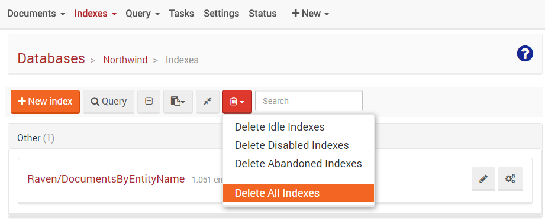

# Unit 2, Lesson 1 - Getting started with indexes

Here we go! Welcome to your first lesson of Unit 2.


## RavenDB does no table scans!

Yes, you read that right. But what does it mean? In Unit-1 you wrote a query similar
to the following:

````csharp
var orders = (
    from order in session.Query<Order>()
    where order.Company == "companies/1"
    orderby order.OrderedAt
    select order
    ).ToList();
````

You might assume that the following pseudo code is run in the server side. Am I right?

````csharp
//..
var results = new List<Order>();

foreach (var o in GetDocumentsFor("Orders"))
{
    if (o.Company == "companies/1")
        results.Add(o);
}

var orderedResults = results.Sort((a,b) => a.OrderedAt.CompareTo(b.OrderedAt));
// ..
````

The previous code is known as *table scan*. That is, all documents are analyzed
and those that meet the predicate are selected. This is quite efficient, as long as the
number of items you have in the database is small. But it fails pretty horribly
the moment your data size reaches any significant size.

## RavenDB uses indexes to speed up the queries

Even when you do not create an index, RavenDB will use one to execute queries.
In fact there are no *O(N)* operations in general in RavenDB queries. Using indexes,
queries in RavenDB are *O(logN)* operations. For those who don't care about
algorithms complexity analysis, the difference is between waiting 30 minutes for a result
and getting it right away.


RavenDB is safe by default and whenever you make a query, the query optimizer will try
to select an appropriate index to use. **If there is no such appropriate index, then
the query optimizer will create an index for you.**

## Exercise 1: Confirming that index can be automatically created
In this lesson you will confirm that RavenDB creates indexes automatically when it
is needed.

### Step 1: Access Northwind database using the Management Studio

Start RavenDB console (if you didn't do it yet), and using the web browser, access the
`RavenDB Management Studio` at the address `http://localhost:8080` (which is the
default address. Change it if you need). Then open the `Northwind database` which you
created in the previous unit ([Lesson 1](../../Unit-1/lesson1/README.md)).

### Step 2: Delete all the existing indexes
Go to the `Indexes tab`, click at the `Trash tool` and then `Delete All Indexes`.  
After a little processing, all indexes will be deleted for you.



### Step 3: Create and execute a program which will perform a query
Create a new Console Application, add the proper NuGet RavenDB reference (`RavenDB.Client`).

Then, change the `Program.cs` content to the following:

````csharp
using System;
using System.Linq;
using Raven.Client.Document;

namespace IndexingSample
{
    class Program
    {
        static void Main()
        {
            using (var session = DocumentStoreHolder.Store.OpenSession())
            {
                var ordersIds = (
                    from order in session.Query<Order>()
                    where order.Company == "companies/1"
                    orderby order.OrderedAt
                    select order.Id
                    ).ToList();

                foreach (var id in ordersIds)
                {
                    Console.WriteLine(id);
                }
            }
        }
    }

    public static class DocumentStoreHolder
    {
        private static readonly Lazy<IDocumentStore> LazyStore =
            new Lazy<IDocumentStore>(() =>
            {
                var store = new DocumentStore
                {
                    Url = "http://localhost:8080",
                    DefaultDatabase = "Northwind"
                };

                return store.Initialize();
            });

        public static IDocumentStore Store =>
            LazyStore.Value;
    }

    public class Order
    {
        public string Id { get; set; }
        public string Company { get; set; }
        public DateTimeOffset OrderedAt { get; set; }
    }
}
````
Note that the `Order model class` has just enough code here.

### Step 5: Run the program

### Step 4: Confirm that a new index was automatically created

Return to the `Management Studio` and go to the `Indexes tab`. Surprise! A new
index named `Auto/Orders/ByCompanyAndOrderedAtSortByOrderedAt` was created for you.

RavenDB chooses good names for "auto created indexes".

## Great job! Onto Lesson 2!

Awesome! You just learned a little bit about how RavenDB performs queries.

**Let's move onto [Lesson 2](../lesson2/README.md) and learn how to create and index by your own.**
