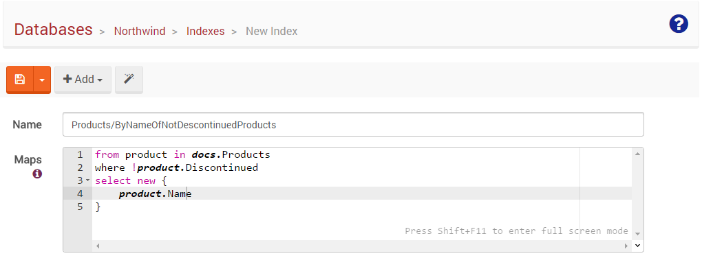

# Unit 2, Lesson 2 - Creating an index and querying using it

As you learned in the [previous lesson](../lesson1/README.md), RavenDB
automatically creates and manages indexes for most common queries, but
for some cases you will need to create indexes yourself.

In this lesson you will learn two ways to create a basic index: Using the RavenDB Studio and
the C# API . This is fundamental to get on more advanced concepts.

## But .. what is an index?

An index is a data structure which RavenDB engine uses to perform all queries.
Thanks to this data structure, RavenDB can quickly locate data without having
to search every document in the database.

Internally, RavenDB uses Lucene as the index store, [Lucene.net](https://lucenenet.apache.org/) to be more exact - a port of the Lucene Search engine library
written in C#.

## The `Map` function

The first thing you need to realize is that RavenDB databases are schema-less,
and as such, the engine has no knowledge of the structure of the documents
it contains. The basic element of an index definition is the `Map` function which
is responsible for converting a document in JSON format into an
index entry.

The `Map` function extracts pieces of data you will be willing to search on
from the documents.

You will use LINQ syntax to express how the data should be extracted (or mapped).

Just as an example, this is the Map function automatically created by RavenDB in the
[previous lesson](../lesson1/README.md).

````csharp
from doc in docs.Orders
select new {
	OrderedAt = doc.OrderedAt,
	Company = doc.Company
}
````

> You can check it out yourself just by editing the index using the `RavenDB Management Studio`

This tells RavenDB to look only at documents of the `Orders` collection and
to map the properties `OrderedAt` and `Company`. The output, as you can deduce, is a set of anonymous objects.

## Exercise: Creating your first index using the `RavenDB Management Studio`

In this exercise you will learn how to create a basic index using the `RavenDB Management Studio`.

### Step 1: Access Northwind database using the Management Studio

Start RavenDB console (if you haven't do so yet), and using the web browser, access the
`RavenDB Management Studio` at the address `http://localhost:8080` (which is the
default address. Change it if you need to). Then open the `Northwind database` which you
created in the previous unit ([Lesson 1](../../Unit-1/lesson1/README.md)).

### Step 2: Start the creation of a new Index
Go to the `Indexes tab`, click on the `New Index`.

### Step 3: Specify the index name
There is no fixed naming rules with RavenDB. But, I strongly recommend
to follow some convention. For this index, let's use `Employees/ByFirstAndLastName` (`collection name`/By
`selected fields` Of `filtering criteria`)

### Step 4: Specify the `Map` function
Enter the following Map function:

````csharp
from doc in docs.Employees
select new {
	FirstName = doc.FirstName,
	LastName = doc.LastName
}
````

> PRO TIP: Use the `Format Maps and Reduce tool` to get a nice formatting of your code. You will receive an
error message if there is something wrong.

In the expression, `docs` represents the entire collection of documents
stored in the database. `docs.Employees` represents all documents from the `Employees` collection.



### Step 5: Save the index
Just click the save button. This will start a background indexing process
that will feed the index with all the documents.

That's it. You just created your first index.

## Exercise: Creating your first index using the C\# API

So far, we worked with indexes inside the studio. But you probably want
to manage them within your codebase. That is why RavenDB allows you to define indexes
using code.

In this exercise you will learn how to create a basic index using the C# API and you
will use the `Northwind` database.

### Step 1: Create a new project and install the latest `RavenDB.Client` package

Start Visual Studio and create a new `Console Application Project` named
`CreatingARavenIndexWithCSharp`. Then, in the `Package Manager Console`, issue the following
command:

```Install-Package RavenDB.Client```

This will install the latest RavenDB.Client binaries, which you will need in order
to compile your code.

Then you will need to add the `using` name space at the top of `Program.cs`:

````csharp
using Raven.Client.Document;
````

### Step 2: Initialize the `DocumentStore`

Again, let's do it using our good friend pattern `DocumentStoreHolder`.

````csharp
public static class DocumentStoreHolder
{
    private static readonly Lazy<IDocumentStore> LazyStore =
        new Lazy<IDocumentStore>(() =>
        {
            var store = new DocumentStore
            {
                Url = "http://localhost:8080",
                DefaultDatabase = "Northwind"
            };

            return store.Initialize();
        });

    public static IDocumentStore Store =>
        LazyStore.Value;
}

````

### Step 3: Write the model classes

Let's define very basic class models. Edit any Employee document in the RavenDB Studio and
use the `Generate Class tool` .

````csharp

public class AddressClass
{
    public string Line1 { get; set; }
    public object Line2 { get; set; }
    public string City { get; set; }
    public string Region { get; set; }
    public int PostalCode { get; set; }
    public string Country { get; set; }
}
public class Employee
{
    public string LastName { get; set; }
    public string FirstName { get; set; }
    public string Title { get; set; }
    public AddressClass Address { get; set; }
    public DateTimeOffset HiredAt { get; set; }
    public DateTimeOffset Birthday { get; set; }
    public string HomePhone { get; set; }
    public int Extension { get; set; }
    public string ReportsTo { get; set; }
    public object Notes { get; set; }
    public int[] Territories { get; set; }
}
````

By default, the `Generate Class tool` does not include the `Id` property. Here we will not use it. If you want this
property, add it.

### Step 4: Write the `index definition` class

````csharp
public class Employees_ByFirstAndLastName : AbstractIndexCreationTask<Employee>
{
    public Employees_ByFirstAndLastName()
    {
        Map = (employees) =>
            from employee in employees
            select new
            {
                FirstName = employee.FirstName,
                LastName = employee.LastName
            };
    }
}
````

The class name `Employees_ByFirstAndLastName`, by convention, will generate
an index named `Employees/ByFirstAndLastName`.

The class inherits from `AbstractIndexCreationTask<Employee>`, which indicates
this class as an index that operates on the `Employees` collection.

### Step 5: Sending the indexes to the server

In the previous step you just wrote the index definition. In order to create
the index you need to execute it, like so:

````csharp
class Program
{
    static void Main()
    {
        var store = DocumentStoreHolder.Store;
        new Employees_ByFirstAndLastName().Execute(store);
    }
}
````

If you create or modify an index, when you execute it, RavenDB will create/modify
the index on the server. If the server side index definition matches the index
definition in the client, the operation has no effect.

> If you want to learn other ways to deploy indexes, you can read more about this topic in the [official documentation](http://ravendb.net/docs/article-page/latest/csharp/indexes/creating-and-deploying).

In one of next lessons you will learn how to send the indexes definitions
during the `Document Store` initialization.


### Step 6: Run!

Delete all indexes as you learned in the [previous lesson](../lesson2/README.md). Then,
go ahead and execute your program.

You will see a new index is created for you.

## Querying

RavenDB is smart enough to select the right index for you. But, if you want,
you can specify what index should be used using an additional type parameter
of the `Query` method.

````csharp
using (var session = DocumentStoreHolder.Store.OpenSession())
{
    var results = session
        .Query<Employee, Employees_ByFirstAndLastName>()
        .Where(x => x.FirstName == "Robert")
        .ToList();

    foreach (var employee in results)
    {
        Console.WriteLine($"{employee.LastName}, {employee.FirstName}");
    }
}
````

## Great job! Onto Lesson 3!

Awesome! You just learned how to create indexes using RavenDB.

**Let's move onto [Lesson 3](../lesson3/README.md) **
