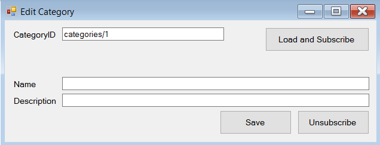

# Unit 3, Lesson 4 - I am going through changes ...

At this point you already know how to perform low-level operations with RavenDB. Nice!

In this lesson, you will learn how to use the [Changes API](http://ravendb.net/docs/article-page/3.5/csharp/client-api/changes/what-is-changes-api)

## What is the `Changes API`

Changes API is an amazing feature that allows you to receive messages from the server about the events occurred there.

Using the Changes API, you will get notified by the server whenever an event you are interested is fired without polling. Polling is wasteful, most of the time you spend a lot of time asking the same
question and expecting to get the same answer.

## Exercise: Getting notified when a document changes

In this exercise, you will learn how to get notifications whenever any document is changed.

### Step 1: Create a new project and install the latest `RavenDB.Client` and `System.Reactive.Core` packages

Start Visual Studio and create a new `Console Application Project` named
`BasicsOfChangesAPI`. Then, in the `Package Manager Console`, issue the following
commands:

```
Install-Package RavenDB.Client
Install-Package System.Reactive.Core
```

Yeap! RavenDB is reactive!

### Step 2: Initialize the `DocumentStore`

As you already know, we will manage the `DocumentStore` using our great friend `DocumentStoreHolder` pattern.  

````csharp
using System;
using Raven.Client;
using Raven.Client.Document;

namespace BasicsOfChangesAPI
{
    public static class DocumentStoreHolder
    {
        private static readonly Lazy<IDocumentStore> LazyStore =
            new Lazy<IDocumentStore>(() =>
            {
                var store = new DocumentStore
                {
                    Url = "http://localhost:8080",
                    DefaultDatabase = "Northwind"
                };

                store.Initialize();

                return store;
            });

        public static IDocumentStore Store =>
            LazyStore.Value;
    }
}

````

### Step 3: Subscribing to changes

Now, it's time to subscribe!

````csharp
using System;
using Raven.Client;
using Raven.Client.Document;

namespace BasicsOfChangesAPI
{
    using static Console;

    class Program
    {
        static void Main(string[] args)
        {
            var subscription = DocumentStoreHolder.Store
                .Changes()
                .ForAllDocuments()
                .Subscribe(change => WriteLine($"{change.Type} on document {change.Id}"));

            WriteLine("Press any key to exit...");
            ReadKey();

            subscription.Dispose();
        }
    }
}
````

It is amazing! Now, every time something changes a document in the server (Put, Delete), your application will get notified. Test it! Change some documents using the Studio and confirm it.

Notice that the change notification include the document (or index) id and the
type of the operation performed. Put or Delete in the case of documents, most
often. If you want to actually access the document in question, you’ll need to
load it using a session (as you already know).

In a "real world" application, you can take actions, such as notify the user (e.g. using
SignalR if you are running a web application).

## What changes are supported by the Changes API?

You can register for notifications on specific documents, all documents with a specific prefix or of a
specific collection, for all documents changes or for updates to indexes.

## Exercise: Simple collaborative editing

Assume that we have an user busy working on a document. And that process
can take a while. In the meanwhile, another user came in and changes that
document. What would be the experience from the point of the user? Well,
either we let the Last Write Win, or we use Optimistic Concurrency. Either
way we’re going to have to annoy someone. How about being able to notify
the user, as soon as the document has updated, that it needs to be refreshed?
This is a good scenario to use the Changes API. In this exercise you will learn
how to do that.

The source code of this exercise is available [here](CollaborativeCategoryEditing).

### Step 1: Create a new project and install the latest `RavenDB.Client` and `System.Reactive.Core` packages

Start Visual Studio and create a new `Windows Forms Application` named
`CollaborativeCategoryEditing`. Then, in the `Package Manager Console`, issue the following
commands:

```
Install-Package RavenDB.Client
Install-Package System.Reactive.Core
```

Yeap! RavenDB is reactive!

### Step 2: Initialize the `DocumentStore`

As you already know, we will manage the `DocumentStore` using our great friend `DocumentStoreHolder` pattern. You can use the code from previous exercise here.

### Step 3: Creating the persistence model  

In this exercise you will create an application that can edit categories from the Northwind database.

````csharp
namespace CollaborativeCategoryEditing
{
    public class Category
    {
        public string Id { get; set; }
        public string Name { get; set; }
        public string Description { get; set; }
    }
}
````

### Step 4: Updating the form layout

The form layout should have some basic elements:

* `CategoryIdTextbox`: Where the user can specify the id of the category that should be loaded.
* `LoadAndSubscribeButton`: Loads the category, creates the subscription object monitoring server-side changes to the specified document, and enables edition related features.
* `NameTextbox` and `DescriptionTextbox`: Document properties.
* `SaveButton`: Saves changes server-side
* `UnsubscribeButton`: Disposes the subscription and disables edition.
* `CategoryIdLabel`, `NameLabel` and `DescriptionLabel`: Labels for the textboxes.

Here is our layout recommendation.



Remember setting the `Enabled` property of `NameTextbox`, `DescriptionTextbox`, `SaveButton` ,`UnsubscribeButton`, `NameLabel` and `DescriptionLabel` to `False`.

### Step 5: Loading documents

Loading document data from server is easy.

````csharp
private IDocumentSession _session;
private Category _category;
private IDisposable _subscription;
private Etag _localEtag;

private void LoadAndSubscribeButton_Click(object sender, EventArgs e)
{
    _session = DocumentStoreHolder.Store.OpenSession();
    _category = _session.Load<Category>(CategoryIdTextbox.Text);

    if (_category == null)
    {
        MessageBox.Show("Category not found!");
        _session.Dispose();
    }
    else
    {
        NameTextbox.Text = _category.Name;
        DescriptionTextbox.Text = _category.Description;

        _localEtag = _session.Advanced.GetEtagFor(_category);
        _subscription = DocumentStoreHolder.Store
            .Changes()
            .ForDocument(CategoryIdTextbox.Text)
            .Where(DocumentChangedByOtherUser)
            .Subscribe(DocumentChangedOnServer);

        ToggleEditing();
    }
}

private void ToggleEditing()
{
    var isEditing = NameTextbox.Enabled;

    // toggle Load and Subscribe feature
    CategoryIdTextbox.Enabled = isEditing;
    CategoryIdLabel.Enabled = isEditing;
    LoadAndSubscribeButton.Enabled = isEditing;

    // toggle Edit feature
    NameTextbox.Enabled = !isEditing;
    NameLabel.Enabled = !isEditing;
    DescriptionTextbox.Enabled = !isEditing;
    DescriptionLabel.Enabled = !isEditing;
    SaveButton.Enabled = !isEditing;
    UnsubscribeButton.Enabled = !isEditing;
}
````

In this exercise you will preserve the session instance to use it again.

When the document is loaded, the associated `ETag` is retrieved, the UI is updated and a subscription for changes in this document is created.

> An etag in RavenDB is a 128 bit number that is associated with a document. Whenever a document is created or updated, an etag assigned to that document is incremented. Etags are heavily used inside RavenDB.

Changes API is compatible with the `Reactive Extensions`, which is great. Because of that we can use filter for events using the familiar LINQ syntax. We will
implement the `DocumentChangedByOtherUser` and `DocumentChangedOnServer` in the following steps.

### Step 6: Saving changes

Whenever the `SaveButton` is clicked the application will send the data to the server.

````csharp
private int _savesCount = 0;
private void SaveButton_Click(object sender, EventArgs e)
{
    _category.Name = NameTextbox.Text;
    _category.Description = DescriptionTextbox.Text;
    _savesCount++;
    _session.SaveChanges();
}
````
The category object is mapped by the session instance. So it is not necessary to call the `Store` method.

The `_savesCount` field will be used later to determine if the change was made by another user.

### Step 7: Dealing with change notifications

The application is subscribing to notifications when document is loaded.

````csharp
private bool DocumentChangedByOtherUser(DocumentChangeNotification change)
{
    if (_savesCount == 0) return true;
    if (change.Etag.Restarts != _localEtag.Restarts) return true;

    var numberOfServerChanges = change.Etag.Changes - _localEtag.Changes;
    return (numberOfServerChanges > _savesCount);
}

private void DocumentChangedOnServer(DocumentChangeNotification change)
{
    var shouldRefresh = MessageBox.Show(
        "Document was changed on the server. Would like to refresh?",
        "Alert", MessageBoxButtons.YesNo
    ) == DialogResult.Yes;

    if (shouldRefresh)
    {
        _session.Advanced.Refresh(_category);
        _savesCount = 0;
        _localEtag = _session.Advanced.GetEtagFor(_category);
        this.Invoke((MethodInvoker) delegate
        {
            NameTextbox.Text = _category.Name;
            DescriptionTextbox.Text = _category.Description;
        });
    }
}  
````

The `DocumentChangedByOtherUser` method is used to filter only notifications from other users. `DocumentChangedOnServer`
asks the user if data should be refreshed. Given a positive response, model and UI are properly updated.

### Step 8: Canceling the subscription

When the user wants to stop editing a document and cancel the subscription, he needs to click on the `UnsubscribeButton`.

````csharp
private void UnsubscribeButton_Click(object sender, EventArgs e)
{
    _session.Dispose();
    _subscription.Dispose();
    ToggleEditing();
}
````

That's it. I strongly recommend you to run two or more instances of this application.

## Great job! Onto Lesson 5!

You just learned how to use the Changes API.

This is an extremely powerful feature that enables a whole host of interesting scenarios.

**Let's move onto [Lesson 5](../lesson5/README.md).**
