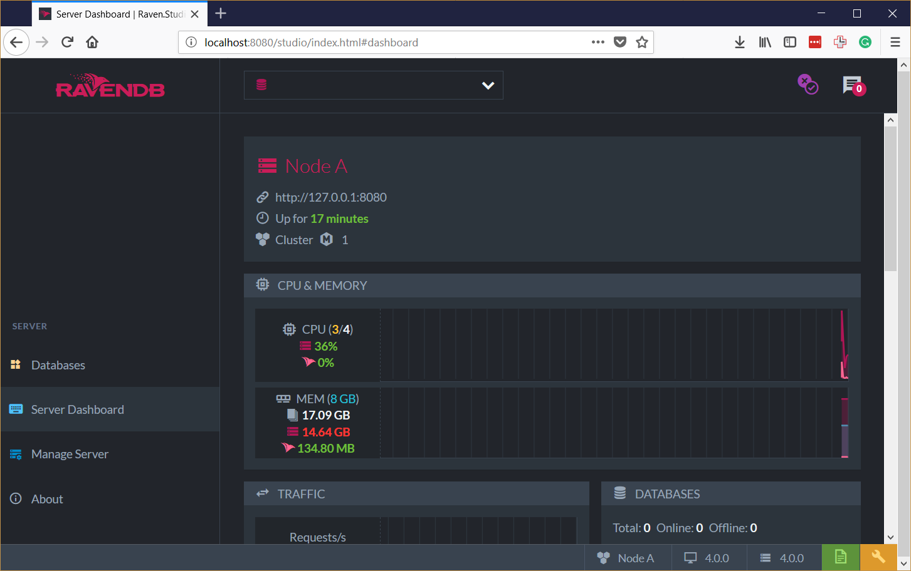
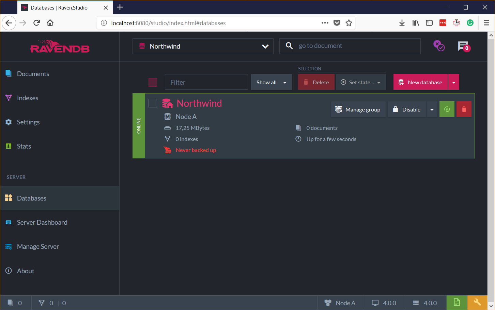
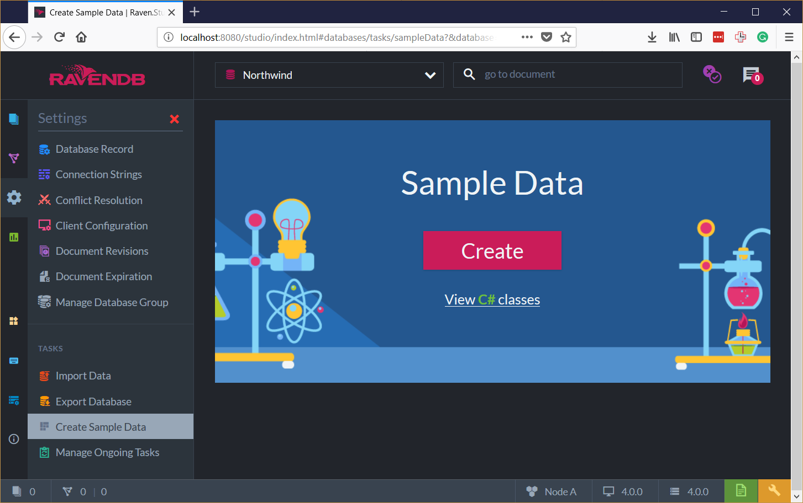
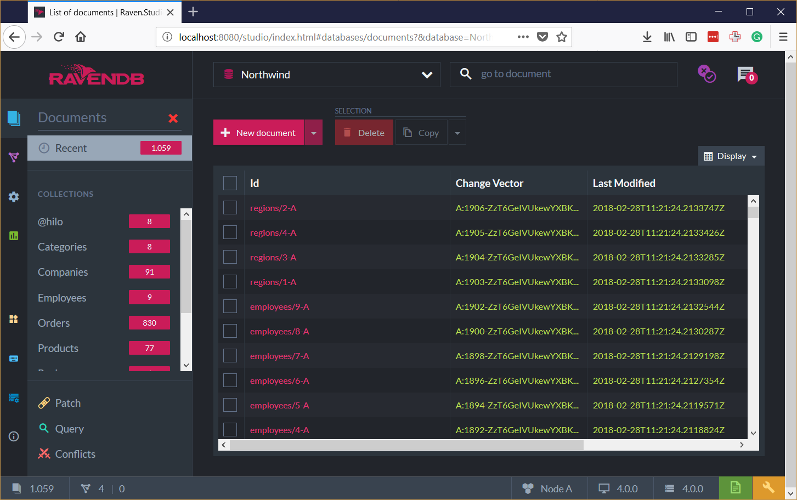
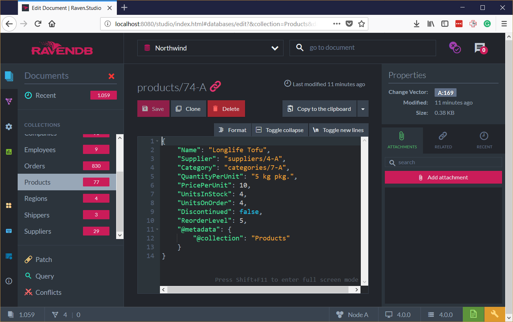

Unit 1, Lesson 1 – Getting Started
==================================

Working with databases does not have to be boring. RavenDB makes your life easier. 
Gone are the days thinking about how to accommodate your data in rows and 
columns. 

Do you already know RavenDB? Not a problem. Prepare to learn some nice surprises and new tricks in this Bootcamp.

Let's start simple. In this lesson, you will learn how to install and start using RavenDB on your computer.

Getting RavenDB up and Running
------------------------------

First things first! 

Let's assume that you are a developer who wants to have RavenDB running on your computer. 

For production scenarios, I recommend you to check other online resources.

### Exercise: Running on the Live Demo Instance

Don’t want to download bits and bytes? No problem! Point your browser to our public 
demo at <http://live-test.ravendb.net>.

Feel free to use our live demo for quick checks and verifications. But, you know you 
shouldn't use it for anything more serious, right? All data in the live instance is 
public! There are no guarantees about availability.

### Exercise: Running on Docker

Now you can get RavenDB up and running with Docker. If you have Docker installed,  
run the following command:

~~~~~~~~~~~~~~~~~~~~~~~~~~~~~~~~~~~~~~~~~~~~~~~~~~~~~~~~~~~~~~~~~~~~~~~~~~~~~~~~
docker run -e UNSECURED_ACCESS_ALLOWED=PublicNetwork -p 8080:8080 ravendb/ravendb
~~~~~~~~~~~~~~~~~~~~~~~~~~~~~~~~~~~~~~~~~~~~~~~~~~~~~~~~~~~~~~~~~~~~~~~~~~~~~~~~

Docker will now get the latest RavenDB version and spin up a new container to
host it. Note that we run it in developer mode without any authentication.

You can learn a lot about how RavenDB works on Docker following the [official documentation](https://ravendb.net/docs/article-page/4.0/csharp/start/installation/running-in-docker-container).

### Exercise: Running on Windows, Linux or MacOS


If you want to set up RavenDB on Windows, Linux, or MacOS, you will need to download 
it from <http://ravendb.net/download>. Make sure you are selecting the right 
distribution for your platform. You will get a compressed file that you can extract to 
a folder of your preference.

Done? 

Now, run the `./run.ps` (or `./run.sh` depending on your operational system) located in RavenDB folder. This will start 
a console application in interactive mode, inside a console application. The script
 will open your browser and start the RavenDB Management Studio.

RavenDB wizard will determine the right address for you. Let's assume in this tutorial it is `http://localhost:8080`.

Running RavenDB for the first time, you will need to do a little setup. You just
need to answer the questions to get it done. More information is available in the [official documentation](https://ravendb.net/docs/article-page/4.0/csharp/start/getting-started)


Your First Database
-------------------

RavenDB Management Studio was completely re-designed. We did a lot of work to make easier to use than ever.



### Exercise: Creating a Database

To create your first database:

1.  Select the `Database` option in the left panel.

2.  Click on the `New Database` button.

3.  Type a name for the new database (we recommend Northwind, in this lesson)

4.  Click on the `Create` button

Congratulations! You just created your first RavenDB database.

But, it is empty.



### Exercise: Loading Sample Data

For learning purposes let’s load some sample data into our database.

1.  Select `Databases` on the left panel
2.  In the right panel, click on the name of the database you just created (that
   is empty for a while)
3.  In the left panel, click on `settings`, and then `Create Sample Data`



4.  Click on the big `Create` button

> The Northwind database is the sample database that came with SQL Server;
it has been used for decades as the sample database in the Microsoft
community. We chose this database as our sample data because you will be familiar with its relational format.

Going to the `Documents` section (left panel), you will see that we created a
lot of documents for you.



Exploring the Database
----------------------

We just launched RavenDB in interactive mode, created our first
database and loaded some sample data. But, wait! It looks remarkably similar to
what you see in a relational database. 

The data is shown in a grid format with the tables on the left.

If you click on any "record", you will start to see the NoSQL magic!



All RavenDB data is stored as JSON.

Understanding the `Document` Concept
------------------------------------

Using the `Go to document` feature (the text box in the Studio toolbar), go to
the document `orders/101-A`.

```json
{
    "Company": "companies/86-A",
    "Employee": "employees/4-A",
    "Freight": 0.78,
    "Lines": [
        {
            "Discount": 0.15,
            "PricePerUnit": 14.4,
            "Product": "products/1-A",
            "ProductName": "Chai",
            "Quantity": 15
        },
        {
            "Discount": 0,
            "PricePerUnit": 7.2,
            "Product": "products/23-A",
            "ProductName": "Tunnbröd",
            "Quantity": 25
        }
    ],
    "OrderedAt": "1996-11-07T00:00:00.0000000",
    "RequireAt": "1996-12-05T00:00:00.0000000",
    "ShipTo": {
        "City": "Stuttgart",
        "Country": "Germany",
        "Line1": "Adenauerallee 900",
        "Line2": null,
        "Location": {
            "Latitude": 48.7794494,
            "Longitude": 9.1852878
        },
        "PostalCode": "70563",
        "Region": null
    },
    "ShipVia": "shippers/2-A",
    "ShippedAt": "1996-11-15T00:00:00.0000000",
    "@metadata": {
        "@collection": "Orders",
        "@flags": "HasRevisions"
    }
}
```

It is very different from what we're used to in relational databases.

>   \> A document is a self-describing, hierarchical tree data structure which
>   can consist of maps, collections, and scalar values.

RavenDB database stores documents, which are plain JSON
formatted data. That means we can aggregate related information into a common object,
as in the case of the `ShipTo` property which has all the shipping information.

In a Document Database, documents are organized in collections.

Understanding the `Collection` Concept
--------------------------------------

Collections provide a good way to establish a level of organization. For
example, documents holding customers data are very different from documents
holding products information, and you want to talk about groups of them. RavenDB
allows for a document to be stamped with a string value that will be evidence of
its type (like "Customers" and "Products").

Note that documents that are in the same collection can have a completely
different structures, which is fine because RavenDB is schema-less.

Exercise: Exploring the Northwind Collections
---------------------------------------------

1.  Open the RavenDB Management Studio at <http://localhost:8080>
2.  Open the Northwind Database
3.  In the `Documents` section, explore all the collections.

The user interface is pretty simple. We strongly recommend you to try to create your documents, edit and so on.
You can create another database and load the sample data if you want.

On To Lesson 2   
-------------------------

Awesome! You have just completed your first lesson.

If you are getting started with document databases and want to learn more about
document modeling, we recommend you to watch this [Ayende’s
talk](https://www.youtube.com/watch?v=FY0BiZaJwL4).


**Let's move onto** [Lesson 2](../lesson2/README.md) **and start querying.**
