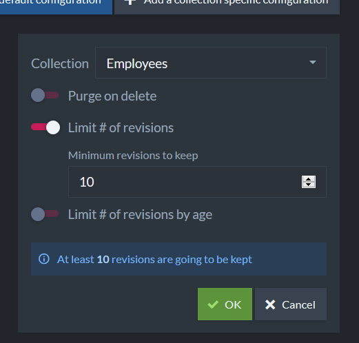
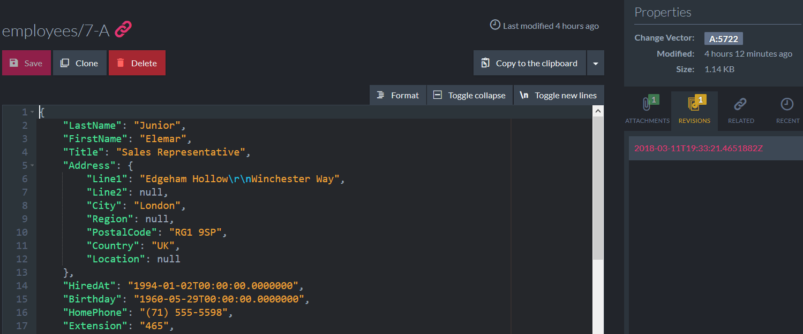

# Unit 3, Lesson 1 - Revisions

Hello and welcome to Unit 3. You already know the basics of using RavenDB. It is time to get started using some more advanced features.

In this lesson, you will learn how to enable document revisions on your databases.

## What are Revisions?

It is a lovely feature! Every time you update, or even delete, a document, RavenDB 4 creates a snapshot (revision) of the previous state. Isn't this cool? More than that, it is useful when you need to track the history of the documents or when you need a full audit trail. 

You can choose to keep track of the last N revisions. Also,  if necessary, you could "track everything".

## How to enable Revisions?

You can configure the revisions feature using the Studio: 


When activated, by default, RavenDB will track history for all documents. Also, by default, RavenDB will never purge old revisions. 

As the administrator, you could configure this for all collections.  But you could specify a different setup for a specific collection. By default, RavenDB will track history for all documents.

The options you have are;

*   **Purge on Delete**: delete the revisions upon the document delete.
*   **Limit # of revisions**: How much revisions to keep.
*   **Limit # of revisions by age**: Configure a minimum retention time before the revisions can be expired.

You can configure it programmatically following the recommendations from the [online documentation](https://ravendb.net/docs/article-page/4.0/csharp/server/extensions/revisions).

## Exercise: Enable revisions for the `Employees` collection

Let's start enabling revisions to the `Employees` Collection.

### Step 1: Open the Northwind database 
Open the `RavenDB Management Studio`, then open the Northwind database (Yes! The same we have been using since the first lesson).

### Step 2: Opening the `Document Revisions` form
On the left panel, select the Settings section and then Document Revisions.

### Step 3: Set up revisions for the Employees collection

* On the top right, click on the `Add a collection specific configuration` option. 
* Select the Employees collection.
* Enable `Limit # of revisions` and inform that you want to save 10 revisions.
* Click on `OK`.
* Click on `Save`



You can test revisions editing a document directly on the Studio. Edit any document and see the list of revisions.



## Retrieving revisions from a document

Retrieving revisions for a document is pretty simple.

```csharp
static void Main(string[] args)
{
    using (var session = DocumentStoreHolder.Store.OpenSession())
    {
        var revisions = session.Advanced.Revisions
            .GetFor<Employee>("employees/7-A");

        foreach (var revision in revisions)
        {
            // process revision
        }
    }
}
```

Nice!

## Great job! Onto Lesson 2!

You now know how to save revisions of your documents using RavenDB. Isn't that fun?

**Let's move onto [Lesson 2](../lesson2/README.md).**
