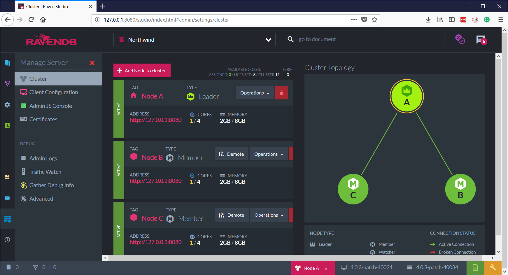

# Unit 4, Lesson 1 - Setting up your first cluster

Now it is time to start learning about how to use clusters.

It is not a difficult task. You do not need to be an expert to manage a RavenDB cluster (We did our best to make it mostly self-managed).

## The Point of Setting up a Cluster

A RavenDB cluster is a set of machines that have been joined together. Each machine in the cluster is a node.

When you create a database, it can live on a single node (one machine in the cluster), some number of the nodes, or even all the nodes. Each node will hold a complete copy of the database and will be able to serve all queries, operations, and writes. RavenDB cluster implements [multi-master replication](https://en.wikipedia.org/wiki/Multi-master_replication).

The primary reason for this duplicating data is to allow high availability. If a node goes down, the cluster will still have a copies of the data and the can shuffle things around so clients can talk to another node without realizing that anything happened.

The cluster can distribute the work, handle the failures, and adopt recovery procedures automatically.

## Let’s Set up a Cluster

Assuming that you are already started the RavenDB server on your computer,  you are already using a cluster. It's a cluster with a single node, but it is still a cluster.

What you need to do is add more nodes to your cluster.

## Can We Simply Add Nodes to a Cluster?

Yes. But first we need to review our license: The RavenDB Community edition only allows you to set up a cluster using 3 cores. Before setting a cluster we will need to reduce the number of cores in use of the current node. You can skip this depending on your license.

In the left panel, select the option `Manage Server`, and then `Cluster`. Then, in the list of nodes (there is only one), click in `Operations` and `Reassign Cores`.

Change the number of Cores in Use to 1 and click on `Save`.

## Exercise: Starting the second node

In this excercise you will learn how to add a second node to the cluster.

### Step 1: Starting a second server instance

Now that the “nodes problem” is solved, let’s start a second instance of the RavenDB server. Typically you would do that on a separate machine, but to make this exercise easier we’ll run it on the same computer. Open a new terminal session and run the following command:

.\Server\Raven.Server.exe --ServerUrl=http://127.0.0.2:8080 --ServerUrl.Tcp=tcp://127.0.0.2:38888 --Logs.Path=Logs/B --DataDir=Data/B

We are specifying the server http address as `http://127.0.0.2:8080` and the tcp address as `tcp://127.0.0.2:38888`. The logs directory is `Logs/B` and the data directory is `Data/B`. **Now there are two servers running on your computer**.

### Step 2: Add the second server as a node in the cluster

Open the `Management Studio` from the first server, then, in the left panel, select the option `Manage Server` and then `Cluster`. Click in `Add Node To Cluster`. Inform the address of the second server and hit `Test Connection`.

Success? Hit `Add`.

## Exercise: Starting the third node

I strongly recommend you to repeat the process to create the third node on `http://127.0.0.3:8080` and storing data at `Data/C` and logs at `Logs/C`. 

This is our result:

In a future lesson, you will learn why it makes little sense to setup a cluster with only two nodes.

## Some New Important Concepts

Now that you know what is a cluster, it's time to learn some new concepts. 

* Database – the named database we’re talking about,  regardless of whether we’re speaking about a specific instance or the whole group.
* Database Instance – exists on a single node.
* Database Group – the grouping of all the different instances, typically used to explicitly refer to its distributed nature.
* Database Topology – the specific nodes that all the database instances in a database group reside on in a particular point in time.

Consider you have a cluster with 5 nodes. It is possible to create a database setting with a replication factor of just 3. In this case, only 3 nodes will have instances of the database. The selected nodes will form the Database Topology and all the three instances will constitute the Database Group. 

## Great Job!

In the next lesson I will help you to create a database, set the replication factor, and define what nodes will compose the Database Topology.

**Let's move onto [Lesson 2](../lesson2/README.md).**