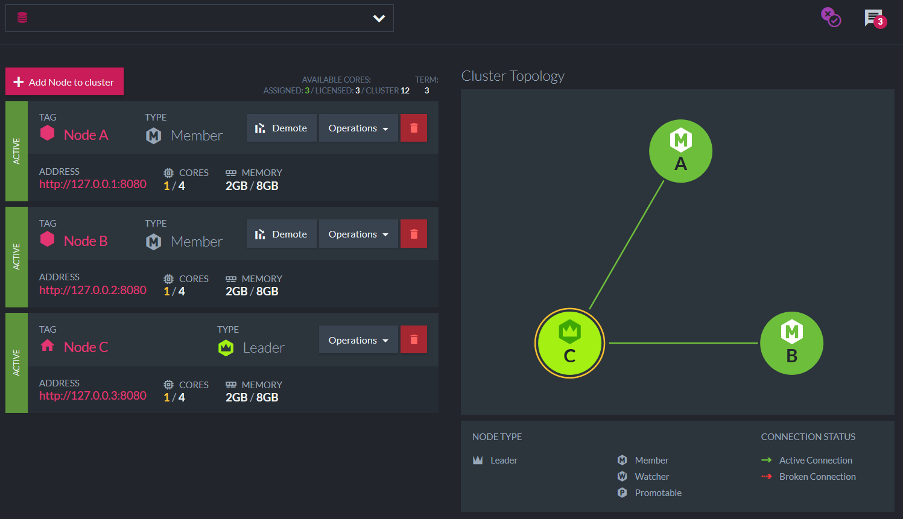
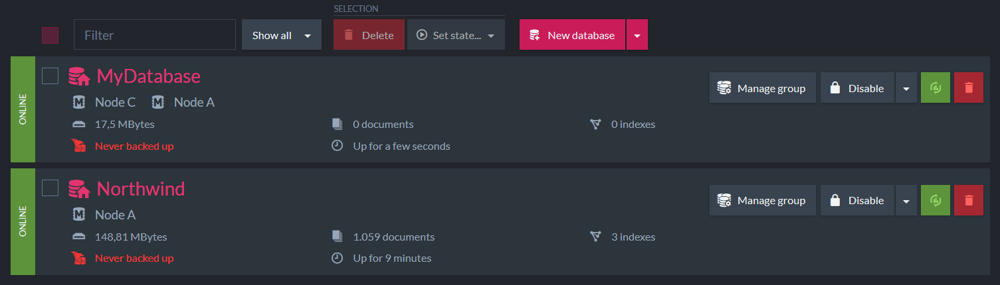

# Unit 4, Lesson 2 - Database and Database Group

Here we go! Welcome to second lesson of Unit 4. Now that you already know how to set up a cluster, let's learn some in depth concepts about how it works. Also, let's create learn how to manage a database in the cluster.

## It's all about "Operations"
Operations in RavenDB can be classified into two categories:

1) cluster-wide operations: that impact the entire cluster. For example,  creating a new database.

2) internal database operations: that impact a single database. For example, creating a new document.

This distinction is vital because of cluster-wide operations demands consensus between the nodes of the cluster and it is only possible when the majority of the nodes is working.  RavenDB uses a consensus protocol called Raft. For example, to create a database in a cluster with three nodes, it would be necessary at least two nodes working (the majority). By the way, this is the reason why you should not have a cluster with only two nodes (when one is down, there is no majority. Got it?).

> There are a lot of details  about how the Raft consensus protocol works in RavenDB that are out of scope to the bootcamp. If you want to understand it in-depth, I recommend you to read the [Ayende's book](https://github.com/ravendb/book) (which is the definitive reference about RavenDB, and it is entirely free).  

Database operations, on the other hand, are treated quite differently. Each node in the cluster has the full copy of the topology, which specifies which nodes host which databases. The connection between the database instances does not use the consensus protocol. Instead of this, they're direct connections among the various nodes, and they form a multi-master mesh. A write to any of those nodes will be automatically replicated to all the other nodes.

Cluster Consensus provides firm consistency (and that is great). Unfortunately,  we also need to ensure availability of the databases, and it is a tradeoff (look for the [CAP theorem](https://en.wikipedia.org/wiki/CAP_theorem) to understand the reasons). So, we decided to provide consistency where it is indispensable and chose explicitly for availability elsewhere.

## Exploratory challenge: What happens when a node goes down?

Assuming you are running a cluster with three nodes, that is the result you get when accessing the `Manage Server` screen on the `Management Studio`.

I recommend you now to stop some nodes and see what happens in the diagram in the right side.

## Focus on robustness
RavenDB design is mainly focused on robustness. Once the cluster is set up, each database instance on the various nodes is independent. That means it can accept writes without consulting the other instances of the same database.

In simple words, even if the majority of the cluster is down, as long as a single node containing a database instance is available, RavenDB can process reads and writes. If a user is writing to the database, RavenDB will hold the data. 

## Creating a new database with replication

Whenever you create a new database, you can specify a replication factor. That is the number of the cluster nodes that will contain an instance of the database.

Again, it is important to remember that creating a database is a cluster-wide operation and requires a majority to work.

## Exploratory challenge: Creating a distributed database

To practice, I would recommend you to create a new database setting the replication factor to two. I would recommend you to call it `MyDatabase`. (I am assuming that you are running the cluster we set up in the last lesson)

## Managing the Database Group
As you already know, the database group is the set of cluster nodes containing the instances of a database. 

You can manage the database group of a specified database accessing `Databases` option in the left panel.

The image displays that the database we just created (assuming that you followed my recommendation) has instances on two nodes (Node C and Node A - It can be different on your computer)

Also, there is a status `Online` indicating that my database is active (meaning that I have an instance of this database running on this cluster node).  Accessing the same screen on the server that has no instance of my new database (in my example, Node B, which is running on `http://127.0.0.2:8080`), the status changes to `Remote` (you know what it means. Right?!).

Clicking on the `Manage Group` button of the database that you want to manage allows you to change the nodes where there are instances of the selected database.

Again, it is important to remember that managing a database group is a cluster-wide operation and requires a majority to work.

##  Exploratory challenge: Managing the Database Group
At this point, let's try to add a new cluster node to the Database Topology. I think you are able to do that. After this, please, access the `Management Studio` of the corresponding node and see that how amazing RavenDB is replicating your data.

## Great job! Onto Lesson 3!

Congratulations. Now you know how to create a database in your cluster. Also, you know how to manage the Database Group.

**Let's move onto [Lesson 2](../lesson2/README.md).**

